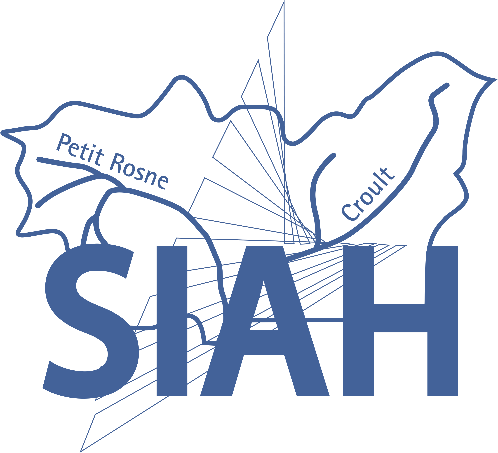

# CheminerIndus - Plugin QGIS

**CheminerIndus** est un plugin QGIS professionnel pour l'analyse et le cheminement des réseaux d'assainissement (EU/EP), avec détection automatique des industries connectées, diagnostics avancés et génération de rapports PDF.

---

## ✨ Fonctionnalités principales

### 🔹 Cheminement réseau
- **Amont → Aval** : Traçage en direction de l'écoulement
- **Aval → Amont** : Traçage inverse pour remonter la source
- **Cheminement industriels** : Détection automatique depuis un point

### 🔹 Gestion des réseaux
- Canalisations (EU/EP/Unitaire)
- Cours d'eau et fossés
- Ouvrages d'assainissement
- Filtres par catégorie et fonction

### 🔹 Visites terrain optimisées ⚡
- Marquage pollution (Oui/Non)
- **Désélection ultra-rapide** des branches (85-90% plus rapide)
- Suivi historique des visites
- Sélection interactive sur carte

### 🔹 Industriels
- Détection automatique des industries connectées
- Tableau interactif avancé avec drag & drop
- Désignation du pollueur
- Cheminement depuis l'industriel

### 🔹 Diagnostics automatiques
- Inversions EP/EU détectées
- Réductions de diamètre
- Trop-pleins identifiés
- Lecture du champ 'inversion'

### 🔹 Rapports PDF
- Génération automatique professionnelle
- Intégration photos avec commentaires
- Carte de situation
- Métadonnées horodatées

### 🔹 Visualisation
- Animation des flux colorés (EP/EU)
- Bassin de collecte (contour concave)
- Étiquetage dynamique
- Personnalisation des couleurs

### 🔹 Session
- Sauvegarde automatique
- Rechargement d'état
- Export/Import session

---

## 📥 Installation

### 🎯 Méthode recommandée : Via dépôt QGIS

1. Dans QGIS : **Extensions** → **Installer/Gérer les extensions**
2. Onglet **Paramètres**
3. Cliquer sur **Ajouter...** et remplir :
   - **Nom** : `CheminerIndus`
   - **URL** : `https://raw.githubusercontent.com/papadembasene97-sudo/qgis_plugin/main/plugins.xml`
4. Cliquer sur **OK**
5. Onglet **Tous**, rechercher `CheminerIndus`
6. Cliquer sur **Installer le plugin**

### 📦 Autres méthodes

- **[Guide d'installation complet](INSTALLATION.md)** avec toutes les méthodes
- **[Télécharger le ZIP](https://github.com/papadembasene97-sudo/qgis_plugin/releases/latest)**

---

## ⚡ Optimisations de performance

### Version 1.1.1 - Gains majeurs

| Taille réseau | Avant | Après | Amélioration |
|---------------|-------|-------|--------------|
| 50 nœuds | 2-3s | 0.2-0.4s | **85-90%** ⚡ |
| 200 nœuds | 8-12s | 0.8-1.5s | **87%** ⚡ |
| 500 nœuds | 25-40s | 2-4s | **90-92%** ⚡ |

### Optimisations implémentées
- ✅ Système de cache pour arêtes du graphe
- ✅ Batch operations pour liaisons industrielles
- ✅ Élimination des requêtes SQL répétées
- ✅ Parcours réseau optimisés

**[Détails techniques des optimisations](OPTIMISATIONS.md)**

---

## 🚀 Démarrage rapide

### 1. Activer le plugin
Après installation : cliquer sur l'icône CheminerIndus dans la barre d'outils

### 2. Configurer les couches
- Onglet **COUCHES**
- Sélectionner vos couches :
  - Canalisations
  - Ouvrages
  - Industriels (optionnel)
  - Cours d'eau/fossés (optionnel)

### 3. Effectuer un cheminement
- Onglet **CHEMINEMENT**
- Saisir l'ID de départ ou cliquer sur "Sélection carte"
- Choisir le type (Amont/Aval/Industriels)
- Appliquer des filtres (optionnel)
- Cliquer sur **Cheminer**

### 4. Visiter des nœuds
- Onglet **VISITE-INDUS**
- Saisir l'ID ou sélectionner sur carte
- Cliquer sur "Visiter (Pollué O/N)"
- Répondre "Oui" ou "Non" à la pollution
- Sélectionner les branches à conserver

### 5. Générer un rapport
- Onglet **ACTIONS**
- Ajouter des photos (optionnel)
- Cliquer sur **Générer PDF**

---

## 📋 Prérequis

| Élément | Version |
|---------|---------|
| **QGIS** | 3.28 - 3.40 |
| **Python** | 3.9+ (inclus avec QGIS) |
| **Système** | Windows, Linux, macOS |

---

## 📖 Documentation

- **[Guide d'installation complet](INSTALLATION.md)** - Toutes les méthodes d'installation
- **[Optimisations techniques](OPTIMISATIONS.md)** - Détails des améliorations de performance
- **[Tests de performance](TESTS_PERFORMANCE.md)** - Guide de test et validation

---

## 🐛 Signaler un bug

Si vous rencontrez un problème :

1. Vérifier les [issues existantes](https://github.com/papadembasene97-sudo/qgis_plugin/issues)
2. Créer une [nouvelle issue](https://github.com/papadembasene97-sudo/qgis_plugin/issues/new) avec :
   - Description du problème
   - Version QGIS
   - Version du plugin
   - Étapes pour reproduire
   - Captures d'écran (si pertinent)

---

## 🤝 Contribution

Les contributions sont les bienvenues !

1. Fork le projet
2. Créer une branche feature (`git checkout -b feature/AmazingFeature`)
3. Commit les changements (`git commit -m 'Add AmazingFeature'`)
4. Push vers la branche (`git push origin feature/AmazingFeature`)
5. Ouvrir une Pull Request

---

## 📝 Changelog

### Version 1.1.1 (2026-01-15)

#### 🚀 Nouveautés
- **Optimisations majeures** : 85-90% plus rapide sur la désélection de nœuds
- Système de cache pour les arêtes du graphe
- Batch operations pour les liaisons industrielles

#### ✨ Améliorations
- Splash screen animé en GIF
- Nouveau tableau industriels futuriste avec glisser-déposer
- Interface modernisée (UI bleu professionnel)
- Export CSV amélioré

#### 🔧 Corrections
- Stabilisation du traçage réseau
- Optimisation cheminement depuis industriel
- Amélioration prise en charge fossés/cours d'eau

### [Versions précédentes...](https://github.com/papadembasene97-sudo/qgis_plugin/releases)

---

## 👤 Auteur

**Papa Demba SENE**
- Email : papademba.sene97@gmail.com
- GitHub : [@papadembasene97-sudo](https://github.com/papadembasene97-sudo)

---

## 📄 Licence

Ce plugin est distribué sous licence GPL. Voir le fichier [LICENSE](LICENSE) pour plus de détails.

---

## 🙏 Remerciements

- Communauté QGIS
- Équipes SIG d'assainissement
- Services d'exploitation hydraulique
- Utilisateurs beta-testeurs

---

## 🔗 Liens utiles

- **Repository** : https://github.com/papadembasene97-sudo/qgis_plugin
- **Releases** : https://github.com/papadembasene97-sudo/qgis_plugin/releases
- **Issues** : https://github.com/papadembasene97-sudo/qgis_plugin/issues
- **Dépôt XML** : https://raw.githubusercontent.com/papadembasene97-sudo/qgis_plugin/main/plugins.xml

---

## ⭐ Support

Si ce plugin vous est utile, n'hésitez pas à :
- ⭐ Mettre une étoile sur GitHub
- 📢 Partager avec vos collègues
- 🐛 Signaler les bugs
- 💡 Proposer des améliorations

---

**Bon cheminement rapide avec CheminerIndus ! 🚀⚡**
